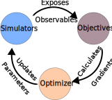

Advanced Usage
==============

Custom Energy Functions
-----------------------

``jax_dna`` supports custom energy functions for ``jax_md`` simulations. Energy
functions are generally comprised of two components: an EnergyFunction and
optionally an EnergyConfiguration.

.. note::
  All implemented EnergyFunctions and EnergyConfigurations should be annotated
  with ``@chex.dataclass``, from `chex <https://github.com/google-deepmind/chex>`_.
  This is a decorator makes the class compatible with
  jax

Custom energy functions should be implemented as subclasses of the BaseEnergy
class, see :doc:`autoapi/jax_dna/energy/base/index`. Further, any custom
energy function should also implement the ``__call__`` function with the
following signature:

.. code-block:: python

    def __call__(
        self,
        body: jax_md.rigid_body.RigidBody,
        seq: typ.Sequence,
        bonded_neighbors: typ.Arr_Bonded_Neighbors_2,
        unbonded_neighbors: typ.Arr_Unbonded_Neighbors_2,
    ) -> float:
      # return a single float that describes the energy for the current state

Here ``body`` is a ``jax_md.rigid_body.RigidBody`` object that contains the
current state of the system, ``seq`` is a sequence of nucleotides, and
``bonded_neighbors`` and ``unbonded_neighbors`` are arrays of bonded and
unbonded neighbors respectively.

By deriving from the BaseEnergy class, the function can be included with other
implemented functions, sharing a common interface. Further the BaseEnergy
function implements helpers like the `+` operator, which can be used to combine
energy functions.

EnergyFunctions are paired with EnergyConfigurations, which are used to store
the parameters of the energy function. More information is available in the
BaseEnergyConfiguration class, see :doc:`autoapi/jax_dna/energy/base/index`.

.. warning::
  Any parameters defined in a EnergyConfiguration should be annotated with
  ``@chex.dataclass``. And all parameters should be optional is the derived
  classes due to the way the base configuration is implemented.

An example of a trivial energy function is show below:

.. code-block:: python

    from typing_extensions import override

    import chex

    import jax.numpy as jnp
    import jax_dna.energy.base as jdna_energy
    import jax_dna.utils.types as typ

    @chex.dataclass
    class TrivialEnergyConfiguration(jdna_energy.BaseEnergyConfiguration):
        some_opt_parameter: float | None = None
        some_dep_parameter: float | None = None

        required_params = ["some_opt_parameter"]

        @override
        def init_params(self) -> "TrivialEnergyConfiguration":
            self.some_dep_parameter = 2 * self.some_opt_parameter
            return self

    @chex.dataclass
    class TrivialEnergy(jd.BaseEnergy):

        @overrride
        def __call__(
            self,
            body: je_base.BaseNucleotide,
            seq: typ.Sequence,
            bonded_neighbors: typ.Arr_Bonded_Neighbors_2,
            unbonded_neighbors: typ.Arr_Unbonded_Neighbors_2,
        ) -> float:

            bonded_i = body[bonded_neighbors[0,:]].center
            bonded_j = body[bonded_neighbors[1,:]].center

            return jnp.sum(jnp.linalg.norm(bonded_i - bonded_j)) + self.config.some_dep_parameter

More examples can be found by looking at the implemented energies in
:doc:`autoapi/jax_dna/energy/base/index`

Advanced Optimizations
----------------------

Beyond the simple optimization covered in :doc:`basic_usage` more sophisticated
optimizations require multiple heterogenous simulations and with multiple kinds
of loss functions. To accommodate this, ``jax_dna`` sets up optimizations using
the following abstractions:

- ``Simulator``: A ``Simulator`` is actor that that exposes one or more
  ``Observables``.
- ``Observable``: An ``Observable`` is something produced by a ``Simulator``. It
  can be a trajectory, scalar, vector, or a tensor. Or really anything that an ``Objective`` needs to compute its the loss/gradients.
- ``Objective``: An ``Objective`` is an actor that takes in one or more
  ``Observables`` and returns the gradients of the ``Objective`` with respect to
  the parameters we want to optimize.
- ``Optimizer``: An ``Optimizer`` coordinates running the ``Simulators`` and to
  produce the ``Observables`` that are needed by the ``Objectives`` to optimize
  the parameters we are interested in.

Using these abstractions ``jax_dna`` leverages the `ray <https://ray.io>`_
library to run ``Simulators`` and ``Objectives`` in parallel across multiple
heterogenous devices. This allows for ``jax_dna`` to schedule ``Simulators`` and
calculate gradients using ``Objectives`` in parallel. This is particularly useful
when the ``Simulators`` are slow to run and the ``Objectives`` are expensive to
compute.

See `advanced_optimizations
<https://github.com/ssec-jhu/jax-dna/tree/master/examples/advanced_optimizations/oxdna>`_
for more details and examples.
